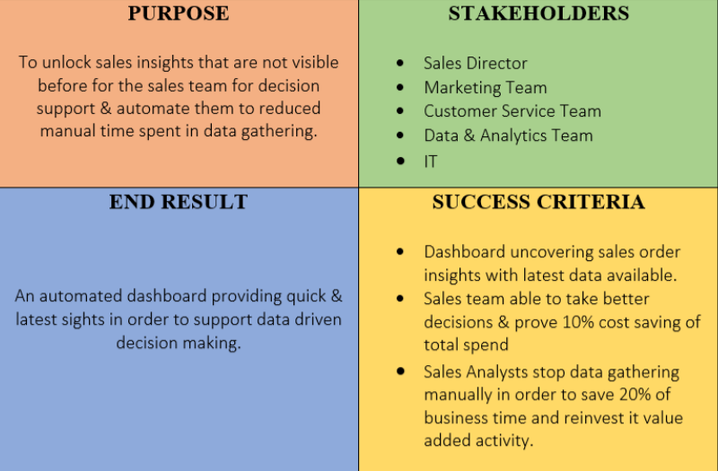
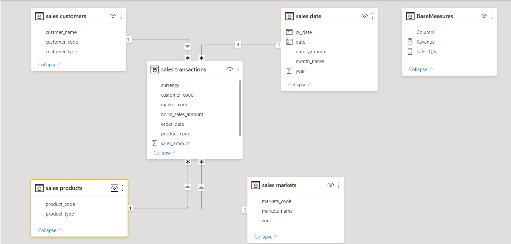
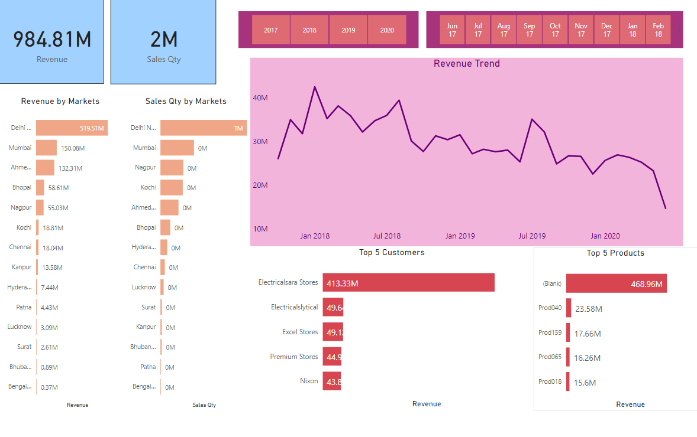

<h1>Sales Insights Using Power BI</h1>
 
<h2>Problem Statement and Solution</h2>

 
<h2>DB Schema</h2>

 
<h2>Dashboard</h2>

Ref: https://www.skillbasics.com/courses/sales-insights-power-bi-project

